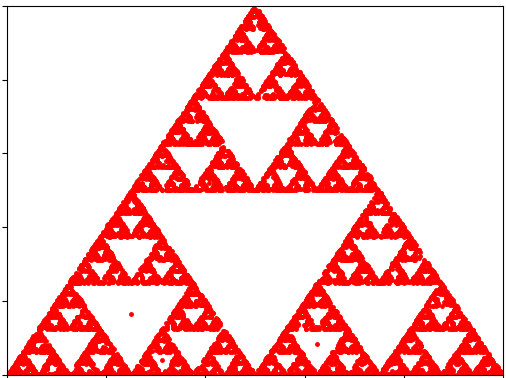

# What's up with fractals?
Fractals are amazing. Like the way my advisor used to explain: A circle is an infinitely smooth shape whereas fractals are invinitely sharp.

# A simple fractal generator
Turns out that fractals are incredibly simple to generate. All you need to do is to keep track of a collection of a point moving randomly. But the movement of the point is constrained, often controlled by a geometry. Let's take triangle for example.

- Consider take a triangle ABC and say you are standing somewhere inside this triangle. 
- Now you pick a corner A or B or C.
- March forward by half the distance between your current position and the choosen corner.
- Repeat from step 2 until the number of iterations you want. 

Typically, more the number of the iterations you run the simualtion, better is the resoltuion. This is what it looks like when you run the simulation.

After about 10000 iterations, we end up with this.

What you see is called Serpinski triangle. What's happening is that basically the three points in 2D (the geometry) acting as a guide for the point that is wanting to move randomly. The interesting thing you'll notice is how much so over you zoom in, you will find a triangle, inside a triangle, inside a triangle, inside a triangle and so on - meaning they are </i>self-similar</i> shapes. 

# The Barnsley Fern
Have you ever seem Mathematics springing into life? With a modified version of the above algorithm with two triangles instead of one can keep track of points to end up with a fern! 

After 10000 iterations (believe your eyes):

I have no words to describe how elegant it is to create something that live with in our daily life but never fail to think further. 

The gift that of doing such simulations is the pleasure of understanding a facet of how nature works. A curiosity to extend the effort to try and generate other artifacts of nature almost irresistably ensues. The next time you stare at a tree, we have more things to be fascinated about. Yes, hidden behind all such complexity there are a simple of rules that nature follows to create all the things we see around.

So the moral of the story is that the next time someone calls you to go out - be it a walk or a trek, please don't say no! 

# References:
- [Chaos Game](https://youtu.be/kbKtFN71Lfs)
- [Barnsley Fern Wiki](https://en.wikipedia.org/wiki/Barnsley_fern)
