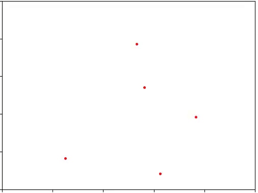
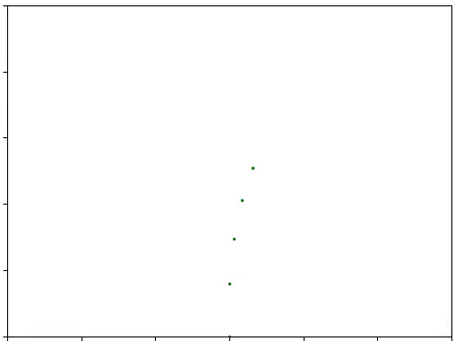
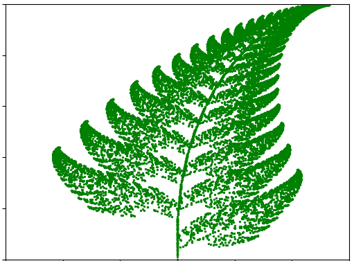

# Fractals?
Stole this from my advisor: A circle is an </b>infinitely smooth</b> shape whereas fractals are </b>invinitely sharp</b>.

# A simple fractal generator
Turns out that fractals are incredibly simple to generate. All you need to do is perform repeated set of transformation to a point. 

- Consider a triangle ABC and say you are standing anywhere "inside" this triangle. 
- Now you pick a corner A or B or C (randomly).
- March forward by half the distance between your current position and the choosen corner.
- Repeat from step 2 until the number of iterations you want. 

Typically, more the number of the iterations you run the simualtion, better is the resoltuion. This is what it looks like when you run the simulation.

The fractal that emerges is called Sierpiński triangle. What's happening is that the three corner points of the triangle (the geometry) act as a guide for the point that is wanting to move randomly. The interesting thing you'll notice is how much so over you zoom in, you will find a triangle, inside a triangle, inside a triangle, inside a triangle and so on. This is why fractals are said to exhibit </i>self-similar</i> property - endlessly repeating its own shape at every scale. 

# The Barnsley Fern - where math springs to life

Consider a slight modification of the above method - with two triangles instead of one. In the previous example, you can choose either of the three corners with equal probablity. For this example, you have a probablity for choosing between the three corners of each triangle and a probablity jumping in-between the two triangles. We will plug-in some pre-computed values of such probablity that adds up to 1. If you repeat the steps, the collection of random points that you end up with litterally looks like a fern! 

After 10000 iterations (yes, believe your eyes):

What's fascinating to me is the fact that simply by repeatedly transforming a point, based on a probabiltiy, can describe shapes that are considerably complex.

You hear people saying that nature is mysterious. Sometimes, behind those mysteries there is an elegance. An elegance that cannot be described using words but can only be felt. 

The gift that of doing such simulations is the pleasure of understanding a facet of how nature works. A curiosity to extend the effort to try and generate other artifacts of nature almost irresistably ensues.

# References:
- [Chaos Game](https://youtu.be/kbKtFN71Lfs)
- [Barnsley Fern Wiki](https://en.wikipedia.org/wiki/Barnsley_fern)
